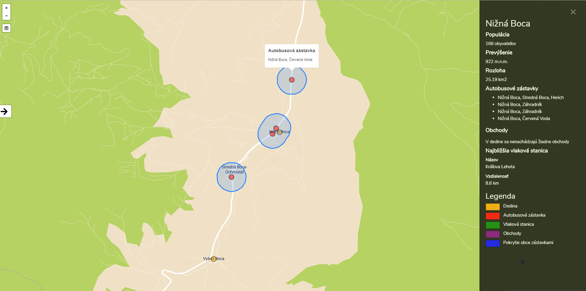

# Overview

Aplikácia slúži na prehľadávanie obcí a jej hlavná funkcionalita prestavuje:
- zobrazenie obcí, kde veľkosť ich markerov sa líši podľa počtu obyvateľov obce
- filtrovanie obcí na základe tagov(objektov, ktorými obec disponuje)
- filtrovanie obcí s potenciálnymi pracovnými ponukami, ktoré sa nachádzajú blízko veľkých miest
- detail obce, ktorý obsahuje dodatočné informácie o obci a zobrazí autobusové zastávky v obci, obchody a najbližšiu vlakovú stanicu
- pokrytie obce autobusovými zástavkami
- možnosť zobrazenia a skrytia objektov na mape
- možnosť rýchleho presmerovania na zástavku, vlakovú stanicu alebo obchodu, kliknutím v detaile obce

Náhľad aplikácie:

Aplikácia pozostáva z troch častí:
- Databáza Postgres využívajúca PostGIS.
- [Frotend](#frontend) aplikácia, ktorá sa stará o zobrazenie geo dát. Využíva pri tom Leaflet mapový komponent a prispôsobený MapBox dizajn. Komunikuje s backend aplikáciou pomocou [REST API](#api). 
- [Backend](#backend) aplikácia, napísana v PHP a postavená na frameworku [Laravel](https://laravel.com/docs/5.7).  

# Frontend

Frontend aplikácia sa zkladá z HTML stránky (`resources/views/website/index.blade.php`), ktorá obsahuje Leaflet mapový komponent a dva bočné panely. Nevyužíva žiadny další framework, je napísaná v čistom javascripte. Stará sa o dynamické zobrazovanie a skrývanie obcí, bočných panelov a ostatných objektov.

Kód v aplikácií je rozdelený do troch súborov:
- `config.js` - konfiguruje mapový komponent
- `utils.js`- obsahuje hlavne funkcie na vykreslenie popup okien a bočných panelov
- `main.js`- posielajú sa v ňom požiadavky na backend a zobrazujú dáta z odpovedí

# Backend

Backend aplikácia je napísaná v jazyku PHP nad frameworkom [Laravel](https://laravel.com/docs/5.7). Logiku aplikácie zabezpečuje `VillageController`, ktorý komunikuje s Postgres datábazou, z ktorej dopytuje dáta v geojson formáte. Tieto dáta následne posiela na frontend pre bočné panely a mapový komponent.

## Data

V aplikácií sa používajú dáta obcí, zástavok, obchodov, staníc a iných súvisiacich objektov zo stredného Slovenska a sú získané z Open Street Maps. Dáta boli importované pomocou nástroja `osm2pgsql`. Na zrýchlenie dopytov do databázy bol vytvorený další stĺpec v tabuľkách `osm_planet_point` a `osm_planet_polygon` nazvaný `geom`, nad ktorým bola spustená funkcia `ST_TRANSFORM(way, 4326)`. Taktiež bol na tento stĺpec vytvorený index. Indexy boli vytvorené aj na ďalšie atribúty, napríklad v tabuľke `planet_osm_polygon` na atribút `boundary`.

Geojson je v aplikácií generovaný pomocou `ST_AsGeoJson` funkcie. Na zjednotenie viacerých útvarov(bodov alebo polygónov)sa používa funkcia `array_to_json`.

## Api

**Získanie všetkých obcí**

`GET /villages`

**Získanie všetkých tagov na filtrovanie**

`GET /amenities`

**Získanie detailu obce s ďalšími objektmi, ktoré sa v nej nachádzajú**

`GET /nearest/{id}/{name}`

**Získanie obcí vo vzdialenosti 10 km od najpotenciálnejších miest**

`GET /potential-villages`

**Získanie obcí, ktoré obsahujú zadané tagy**

`POST /villages`

### Response

Api volanie vracajú dáta na základe toho, či sa jedná o dáta pre bočné panely alebo pre mapový komponent. Pre mapový komponent, sú to data v geojson formáte. 

